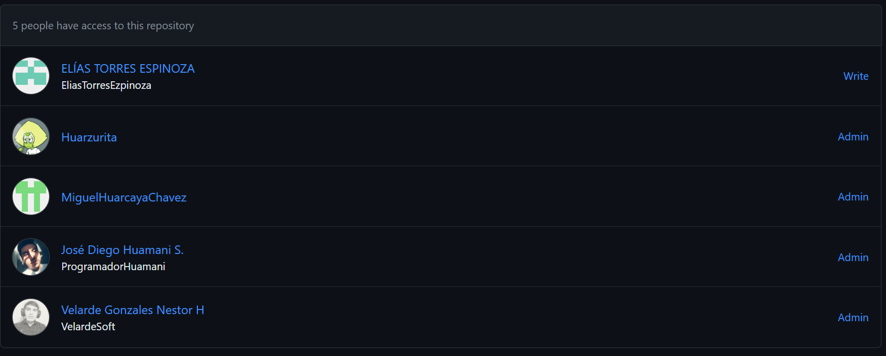
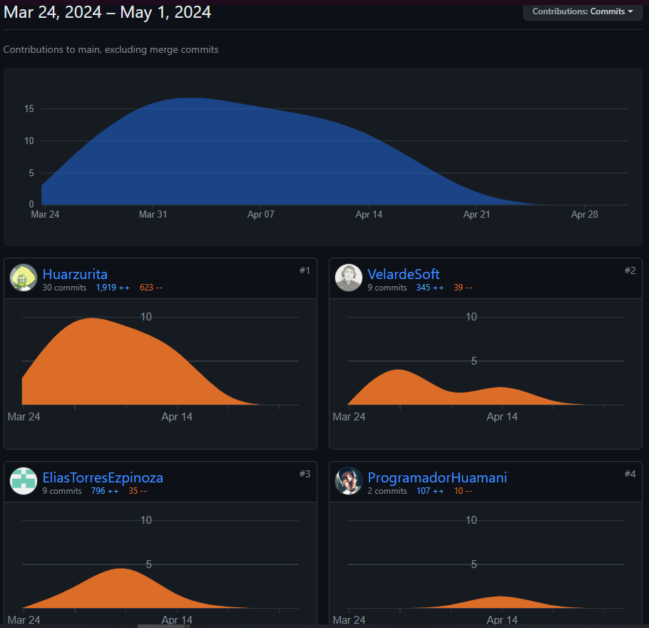
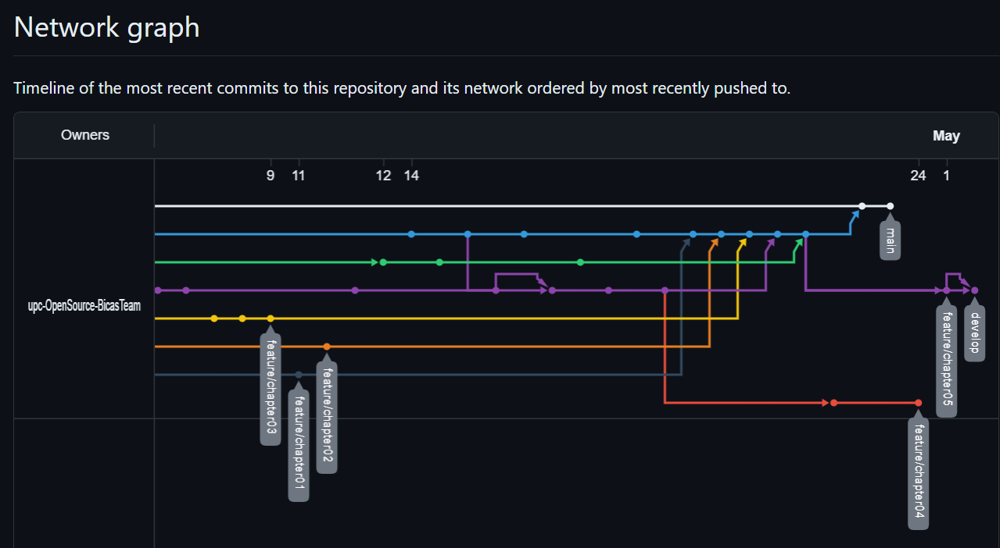
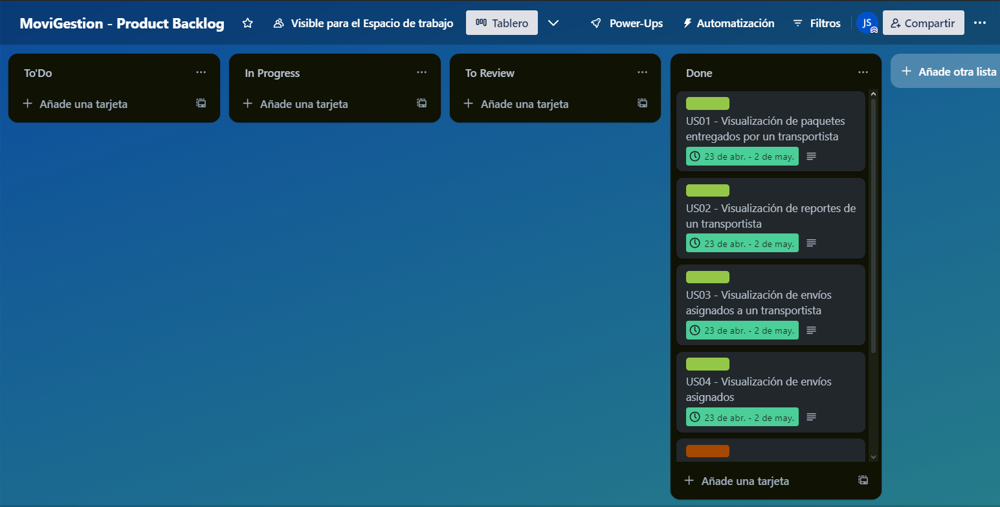

# Capítulo 5: Product Implementation, Validation & Deployment

## 5.1 Software Configuration Management.

Para administrar la configuración de software de nuestra app, nos centraremos en tres aspectos principales: el control del código fuente, que implica gestionar las versiones y establecer una estructura organizada para el código; la configuración del entorno de desarrollo, donde nos aseguramos de que todos los miembros del equipo cuenten con herramientas consistentes; y la configuración de implementación, que se ocupa del despliegue en entornos de producción. Estas decisiones garantizan la coherencia y eficacia a lo largo de todo el ciclo de vida de la aplicación.

### 5.1.1 Software Development Environment Configuration

En esta sección, detallaremos y explicaremos los productos utilizados en el proyecto digital, así como su propósito y cómo se accede a cada uno de ellos y siguiendo las restricciones establecidas.

1. Project Management:
Para gestionar el proyecto, se utilizaron herramientas de comunicación y control de versiones. Se estableció una organización en GitHub para gestionar el código y las versiones del proyecto. Además, para las reuniones de equipo y la comunicación interna, se utilizaron plataformas como Google Meet y Discord.
- Github: https://github.com/
- Google Meet: https://meet.google.com/
- Discord: https://discord.com/download

2. Requirements Management:
Para la gestión de requisitos se llevó a cabo mediante el uso de herramientas personalizadas que permitieron recopilar, organizar y priorizar los requisitos del proyecto de manera eficiente. Se utilizó Trello, una herramienta visual para la gestión de requisitos, permitiendo la creación tableros personalizados para organizar y priorizar las tareas del proyecto que permitió realizar los Task board y Pivotal Tracker, utilizado para gestionar y realizar un seguimiento del Product Backlog del proyecto.
- Trello: https://trello.com/es
- Pivotal Tracker: https://www.pivotaltracker.com/

3. Product UX/UI Design:
Para el diseño de la experiencia de usuario (UX) y diseño de interfaz de usuario (UI) del producto se utilizo la herramienta Figma, esta herrmienta permitio al equipo crear wireframes, mockups y prototipos interactivos para visualizar y validad el diseño del producto antes de la implementación.
Por otro lado, para la creación de User Personas, Empathy Maps, Journey Maps e Impact Maps se utilizó UXPressia y para la creación de As-Is y To-Be Scenario Maps se utilizó Miro.
- Figma: https://www.figma.com/downloads/
- UXPressia: https://uxpressia.com/
- Miro: https://miro.com/es/

4. Software Development:
Para el desarrollo de software se utilizó HTML5, CSS3 y JavaScript para el desarrollo de la Landing Page de la startup, por otro lado, para la creación del Web Application de la startup se utilizarán el framework de AngularJS por el lado del Frontend y en el Backend se utilizará SpringBoot con Java.
Para trabajar con estas tecnologías, se emplearon los siguientes IDEs:
Visual Studio Code: Herramienta principal para el desarrollo Frontend, que ofrece una amplia gama de extensiones para mejorar la productividad del equipo. (En nuestro caso solo fue utilizado para la Landing Page).
JetBrains Toolbox: Proporciona un entorno integrado para el desarrollo web, con características avanzadas de edición y depuración que faciitan la creación de aplicaciones web robustas tanto para el lado FrontEnd como BackEnd.
- Visual Studio Code: https://code.visualstudio.com/
- JetBrains Toolbox: https://www.jetbrains.com/toolbox-app/

5. Software Documentation:
La documentación del software se realizó utilizando GitHub, además de ser utilizado como plataforma de control de versiones, GitHub también se empleó para alojar la documentación técnica del proyecto. Se crearon repositorios específicos para almacenar toda la información. La documentación se gestionó mediante archivos Markdown para facilitar la creación y edición colaborativa.
- GitHub: https://github.com/

### 5.1.2 Source Code Management.

En este proyecto, utilizaremos GitHub como plataforma y sistema de control de versiones para gestionar el código fuente de nuestras diferentes partes del proyecto dentro de una organización.

**Repositorios en GitHub**
- Organización: https://github.com/upc-OpenSource-BicasTeam
- Landing Page: https://github.com/upc-OpenSource-BicasTeam/upc-opensource-bicasteam-landingpage.github.io.git
- Report : https://github.com/upc-OpenSource-BicasTeam/upc-OpenSource-BicasTeam-Report.git

**GitFlow Workflow**
Implementaremos el modelo GitFlow como Workflow de control de versiones, siguiendo las convenciones y prácticas establecidas para una gestión eficiente del desarrollo de software.
1. **Branches Principales:
- `main`: Rama principal del repositorio, contiene el código estable y liberado.
- `develop`: Rama de desarrollo deonde se integran las nuevas características y mejoras.

1. Branches de Funcionalidades (Feature Branches):
- Para cada nueva funcionalidad, se creará una rama de funcionalidad con el prefijo `feature/`, seguido del nombre descriptivo de la función o característica. En nuestro caso, creamos 5 branches de características correspondientes a los 5 capítulos de nuestro informe, donde se realizan los commits respectivos antes de fusionarlos con la rama develop cuando estén listos.

1. Branches de Lanzamiento (Release Branches) y Branches de Corrección (Hotfix Branches):
En nuestro caso, no hicimos uso de estas branches ya que no lo vimos necesario al ser solo documentacion del reporte.

**Versionado Semántico**
Seguimos la especificación Semantic Versioning 2.0.0 para nombrar nuestras versiones, siguiendo el formato: `MAJOR.MINOR.PATCH`.

**Conventional Commits**
Aplicamos el estándar de Conventional Commits para los mensajes de commit, siguiendo un formato estructurado que describe claramente los cambios realizados. Esto nos ayudó a automatizar la generación de notas de versión y facilitar la comprensión del historial de cambos del proyecto.

Con estas prácticas y convenciones adaptadas a una organización en GitHub, buscamos mantener un flujo de desarrollo ordenado, colaborativo y bien documentado.

### 5.1.3 Source Code Style Guide & Conventions.

En esta sección, se establece las convenciones y prácticas que seguiremos para nombrar elementos y programar en los lenguajes utilizados en la solución, que incluyen HTML, CSS, TypeScript, AngularJS, Java, y Gherkin para los archivos `.feature`. Todas las convenciones seguirán la nomenclatura en inglés y adoptarán convenciones estándares de codificación.

1. **HTML y CSS**:
- Basado en las recomendaciones de W3C y otras fuentes de la comunidad, se establecerán convenciones para el nombramiento de elemntos hTML y estilo de la codificación CSS.
- Se seguirán las convenciones recomendadas por Google para HTML y CSS, que incluyen el uso de identaciones de 2 espacios, el uso de comillas dobles para atributos y el uso de comentarios descriptivos.
- Se utilizará la metodologìa BEM para organizar las clases CSS en bloques, elementos y modificadores, lo que facilitará la modularidad y la reutilización del código. 
- Se debe utilizar los elementos HTML de manera semántica para una correcta descripción del contenido del sitio web, incluyendo el uso adecuado de etiquetas.
- Para el desarrollo con AngularJS, se adoptarán las convenciones recomendadas por la comunidad de Angular, que incluyen el uso de PascalCase para los nombres y componentes y el uso de camelCase para las propiedades y métodos de los componentes.

2. **TypeScript**:
- Se tomarán en cuenta las directrices proporcionadas por TypeScript Handbook para la escritura del superset JavaScript, que incluyen el uso de nombres descriptivos para variables y funciones en camelCase, el uso de declaración de variables con `let` o `const` en lugar de `var`, y el uso de punto y coma al final de cada declaración.
- Se seguirán las convenciones de codificación recomendadas por Google para JavaScript, que incluyen el uso de comillas simples para literales de cadena, el uso de comentarios descriptivos y el uso de funciones de flecha para expresiones de función.

3. **AngularJS**:
- Se adoptarán las convenciones de codificación recomendadas por la comunidad de aplicaciones de AngularJS, que incluyen el uso de directivas de flujo de control declarativas, manipualcion de componentes, el uso de ciclo de vida y la organización de los componentes en carpetas y subcarpetas según su función utilizando el Domain Driven Design (DDD).

4. **Java (SpringBoot)**:
- Se seguirán las convenciones de codificación establecidas por Manual de Código Limpio para el lenguaje Java, que incluyen el uso de PascalCase para nombres de clases y métodos, el uso de camelCase para nombres de variables locales y parámetros, y el uso de comentarios XML para documentar el código.
- Para el desarrollo en SpringBoot, se adoptarán las directrices proporcionadas por Spring en sus guías de codificación, que incluyen el uso de inyección de dependencias, la separación clara entre capas de la aplicación y el uso de modelos de vista para la comunicación entre el controlador y la vista.

5. **Gherkin**:
- Se aplicarán las convenciones recomendadas para escribir especificaciones legibles en Gherkin, que incluyen el uso de palabras clave como Given, When y Then para describir el comportamiento del sistema, el uso de un lenguaje sencillo y claro, y la organización de los escenarios en contextos, acciones y resultados.
- Se seguirán las mejores prácticas recomendadas por Cucumber para escribir escenarios de prueba en Gherkin, que incluyen la reutilización de pasos de prueba, la modularización de escenarios y la escritura de pruebas autoexplicativas.

Además de estas referencias, se promoverá el uso de buenas prácticas y metodologías estándar en el desarrollo de software, como la modularidad, la reutilización de código, la legibilidad del código, la optimización del rendimiento y la seguridad. 
Con estas guías de estilo y convenciones de codificación, buscamos asegurar la coherencia, la calidad y la mantenibilidad del código a lo largo de todo el proyecto.

### 5.1.4 Software Deployment Configuration.

En esta sección, describiremos la configuración necesaria para desplegar satisfactoriamente cada uno de los productos digitales de nuestra solución, incluyendo Landing Page, los Web Services y las Frontend Web Applications.

**Pasos para el despliegue**
1. Landing Page:
- Clonar o descargar el repositorio desde GitHub.
- Configurar el servidore web para alojar la Landing Page.
- Copiar los archivos HTMLS, CSS y JavaScript en el directorio correspondiente del servidor.
- Configurar cualquier dependencia adicional, como bibliotecas de JavaScript o imágenes.
- Verificar quue la Landing Page se cargue correctamente en el navegador.

2. Web Services (API):
- Preparar el código fuente del servicio web, asegurando que esté correctamente estructurado y documentado.
- Configurar un entorno de desarrolo o pruebas para realizar pruebas exhaustivas del servicio antes del desplieguee.
- Desplegar el código en un servidor adecuado para el entorno de producción.
- Configurar la seguridad y la autenticación según los requisitos del sistema.
- Documentar la API utilizando OpenAPI Specification para facilitar su integración y uso por parte de otros sistemas.

3. Frontend Web Applications:
- Clonar repositorio desde GitHub.
- Compilar y empaquetar las aplicaciones frontend. En nuestro caso, utilizamos el framework Vue.js, por lo que se debe ejecutar los comandos de construcción (`npm run build`) para generar los archivos estáticos.
- Una vez empaquetadas, las Frontend Web Applications se pueden servir utilizando un servidor de aplicaciones compatible con archivos estáticos, como Nginx o incluso GitHub Pages para proyectos estáticos más simples.
- Si es necesario, se deben configurar las rutas en el servidor de aplicaciones para que conincidan con las rutas esperadas por las aplicaciones frontend.

## 5.2 Landing Page, Services & Applications Implementation.

En esta sección, describiremos el proceso de implementación, pruebas, documentación y despliegue de la Landing Page, los Web Services y las Frontend Web Applications. Abordaremos cada componente de manera individual a lo largo de los diferentes sprints, comenzando en este Sprint 1 con la implementación específica de la Landing Page. Una vez establecido nuestro Product Backlog, cada sprint se dividirá en secciones internas para abordar cada aspecto de la implementación y la colaboración del equipo.

### 5.2.1 Sprint 1

En esta sección, documentaremos y explicaremos el progreso tanto en el desarrollo del producto como en la colaboración del equipo durante el Sprint 1. Seguimos un proceso definido que abarca desde la planificación hasta la revisión y documentación del trabajo realizado. A lo largo de las siguientes secciones, detallaremos cómo se llevó a cabo la planificación del sprint, qué tareas se incluyeron en el Sprint Backlog, las pruebas y evidencia de desarrollo para la revisión del sprint, así como la documentación de los servicios y las percepciones clave sobre la colaboración del equipo durante este periodo

### 5.2.1.1 Sprint Planning 1

En esta sección, se detallan los aspectos principales del Sprint Planning Meeting para el Sprint n. Este encuentro es crucial para establecer los objetivos del sprint, determinar las user stories que se abordarán y asignar tareas al equipo. A continuación, se presenta un resumen del Sprint Planning Meeting para este período.

| Sprint #                             | Sprint 1           |
|--------------------------------------|--------------------|
| Sprint Planning Background                                |
| Date                                 |  2024-03-23        |
| Time                                 |  01:30 PM          |
| Location                             |  Virtual (Discord) |
| Prepared By                          |   Miguel Huarcaya Chavez   |
| Attendees (to planning meeting)      |  Todo el equipo |
| Sprint 1 – 1 Review Summary          |  Durante el primer sprint, avanzamos significativamente en el desarrollo del producto y logramos una colaboración eficiente dentro del equipo. Alcanzamos hitos importantes y recopilamos retroalimentación valiosa que nos servirá como base para el próximo sprint.  |
| Sprint 1 – 1 Retrospective Summary   |  En la retrospectiva del primer sprint identificamos áreas para mejorar, como la comunicación y la estimación de tareas. Estamos comprometidos a implementar acciones correctivas y mejorar continuamente nuestro proceso de trabajo.  |
| Sprint Goal & User Stories                                |
| Sprint 1 Goal                        | Alcanzar una métrica de cumplimiento del 100%, lo que indicará que se ha logrado los objetivos del sprint 1.        |
| Sprint 1 Velocity                    | Acordamos aceptar 4 Story Points como nuestra capacidad de entrega para este sprint.     |
| Sum of Story Points                  | La suma de los Story Points para los User Stories que se están incluyendo en este Sprint 1 es 6 |

### 5.2.1.2 Sprint Backlog 1

El Sprint 1 está centrado en la implementación de las funcionalidades clave de la landing page del sitio web, priorizando las historias de usuario identificadas. Nuestro objetivo principal es proporcionar a los visitantes una experiencia inicial sólida al presentar de manera clara y concisa las características y beneficios del sitio, junto con una navegación intuitiva y acceso rápido a la información relevante. Al completar las tareas asociadas a las historias de usuario definidas, sentaremos las bases para futuras iteraciones, asegurando que la página de inicio cumpla con las expectativas de los usuarios y contribuya al éxito del proyecto.

URL del Board en Trello: https://trello.com/invite/b/9fFNzPVl/ATTId6d62a99d06e758b547d220c4b08a09131B77500/appweb

<table>
    <tr>
        <td colspan="2">Sprint #</td>
        <td colspan="6">Sprint 1</td>
    </tr>
    <tr>
        <td colspan="2">User Story</td>
        <td colspan="6">Work-Item / Task</td>
    </tr>
    <tr>
        <td>Id</td>
        <td>Title</td>
        <td>Id</td>
        <td>Title</td>
        <td>Descripcion</td>
        <td>Estimation (Hours)</td>
        <td>Assigned To</td>
        <td>Status (To-do / In / Process / ToReview / Done)</td>
    </tr>
    <tr>
        <td>US17</td>
        <td>Landing - Resumen del sitio web</td>
        <td>T05</td>
        <td>Desarrollar resumen claro y conciso sobre las características y beneficios del sitio web en la página de inicio.</td>
        <td>Crear una sección de resumen en la página de inicio que presente de manera clara y concisa las principales características y beneficios del sitio web, destacando los puntos más relevantes de manera atractiva y fácil de entender.</td>
        <td>2 hora</td>
        <td>Jose Diego huamani</td>
        <td>Done</td>
    </tr>
    <tr>
        <td>US18</td>
        <td>Landing - Resumen de precios</td>
        <td>T06</td>
        <td>Implementar acceso claro y visible a la información detallada de los planes ofrecidos en la página de inicio.</td>
        <td>Integrar un acceso claro y visible en la página de inicio que permita a los visitantes buscar información detallada sobre los planes ofrecidos, incluyendo características, beneficios, limitaciones, términos y condiciones, precio y cualquier otra información relevante.</td>
        <td>3 hora</td>
        <td>Jose diego Huamani</td>
        <td>Done</td>
    </tr>
    <tr>
        <td>US19</td>
        <td>Landing - Información a pie de página</td>
        <td>T07</td>
        <td>Desarrollar un resumen claro y conciso del sitio web al final de la página de inicio.</td>
        <td>Crear un resumen al final de la página de inicio que destaque los aspectos más relevantes del sitio web, como las características principales, los servicios ofrecidos, la información de contacto y cualquier otra información importante para los visitantes.</td>
        <td>1 hora</td>
        <td>Miguel Huarcaya</td>
        <td>Done</td>
    </tr>
    <tr>
        <td>US20</td>
        <td>Landing - Ir a aplicación web directamente</td>
        <td>T08</td>
        <td>Integrar un llamado a la acción claro y visible para dirigir a los visitantes a la aplicación web principal.</td>
        <td>Presentar un llamado a la acción claro y visible en la página de inicio que guíe a los visitantes a explorar más a fondo el sitio web o tomar la acción deseada, como registrarse, suscribirse o contactar al equipo.</td>
        <td>1 hora</td>
        <td>Elias Torres</td>
        <td>Done</td>
    </tr>
    <tr>
        <td>US21</td>
        <td>Landing - Navegación de información</td>
        <td>T09</td>
        <td>Presentar contenido claro, detallado y preciso sobre lo que ofrece el sitio web en la página de inicio.</td>
        <td>Proporcionar contenido claro, detallado y preciso en la página de inicio que describa las características, funcionalidades y beneficios del sitio web de manera comprensible y convincente.</td>
        <td>1 hora</td>
        <td>Nestor velarde</td>
        <td>Done</td>
    </tr>
    <tr>
        <td>US22</td>
        <td>Landing - Navegación de contacto</td>
        <td>T10</td>
        <td>Mostrar información de contacto visible y accesible en la página de inicio.</td>
        <td>Mostrar claramente la información de contacto, como dirección de correo electrónico, número de teléfono y/o dirección física, en una sección destacada de la página de inicio para que los visitantes puedan comunicarse con el sitio web de manera efectiva.</td>
        <td>3 hora</td>
        <td>Elias Torres</td>
        <td>Done</td>
    </tr>
</table>

### 5.2.1.3 Development Evidence for Sprint Review.
Esta sección documenta y presenta la serie de commits realizados en el repositorio del Landing Page. Estos commits, que son una parte integral del proceso de desarrollo, se han gestionado utilizando la metodología GitFlow y siguiendo estrictamente las convenciones establecidas para los commits. Esta evidencia sirve como un registro transparente y trazable de nuestro progreso y esfuerzos de desarrollo a lo largo del sprint.

| Repository                        | Branch              | Commit Id                          | Commit Message                   | Commit Message Body           |Commited on (Date) |
|-----------------------------------|---------------------|------------------------------------|----------------------------------|-------------------------------|-------------------|
| upc-OpenSource-BicasTeam-LandingPage.github.io   | main     | 4ad069c28a25992a9201a92858002309e0bf4df7 | chore: ...                      | initial commit         | 10-04             |
| upc-OpenSource-BicasTeam-LandingPage.github.io   | feature/section-about      | 9a37f7ee1756f0f868e45e7c1b3c71848007824a | feat: ...                      | create services         | 10-04             |
| upc-OpenSource-BicasTeam-LandingPage.github.io   | feature/section-footer      | | upc-OpenSource-BicasTeam-LandingPage.github.io   | feature/section-about      | 9a37f7ee1756f0f868e45e7c1b3c71848007824a | feat: ...           | create footer         | 10-04             | | feat: ...                      | create services         | 10-04             |
| upc-OpenSource-BicasTeam-LandingPage.github.io   | feature/section-footer service     | | upc-OpenSource-BicasTeam-LandingPage.github.io   | feature/section-about service     | d5e5a6eb2c9ad42feed3ed4f36c5aba0654202e5 | fix: ...        | fix footer         | 10-04             | | fix: ...                      | create services         | 10-04             |
| upc-OpenSource-BicasTeam-LandingPage.github.io   | feature/section-pricing      | | upc-OpenSource-BicasTeam-LandingPage.github.io   | feature/section-pricing      | d5e5a6eb2c9ad42feed3ed4f36c5aba0654202e5 | fix: ...   | fix footer         | 10-04             | | feat: ...                      | create services         | 10-04             |
| upc-OpenSource-BicasTeam-LandingPage.github.io   | feat     | cbb29c4b819970c09e9b3de1b84c0de61c758c4e | feat: ...                      | create section header       | 10-04             |
| upc-OpenSource-BicasTeam-LandingPage.github.io   | feat     | d7f5a246629c7aa309e2c2816d2fb1c38a953b85 | feat: ...                      | create section hero       | 10-04             |
| upc-OpenSource-BicasTeam-LandingPage.github.io   | feat     | 09ed97a86a2413031145c4413ec161ff07af625f | feat: ...                      | create section about team       | 10-04             |
| upc-OpenSource-BicasTeam-LandingPage.github.io   | feat     | 09ed97a86a2413031145c4413ec161ff07af625f | feat: ...                      | create section about us       | 10-04             |

### 5.2.1.4 Testing Suite Evidence for Sprint Review. 
En esta sección, presentamos la evidencia de las pruebas realizadas durante el sprint. Hemos utilizado Gherkin para definir los escenarios de prueba y hemos registrado cada prueba en commits específicos en nuestro repositorio. A continuación, se muestra un registro de estos commits:

| Repository                        | Branch              | Commit Id                          | Commit Message                   | Commit Message Body           |Commited on (Date) |
|-----------------------------------|---------------------|------------------------------------|----------------------------------|-------------------------------|-------------------|
| upc-OpenSource-BicasTeam-LandingPage.github.io   | feature/section-header  | 1fbb6f6                           | feat: ...                        | add tests for header section            | 10/04  |
| upc-OpenSource-BicasTeam-LandingPage.github.io   | feature/section-footer  | ee12b07                          | feat: ...                        | add test for footer section           | 10/04  |
| upc-OpenSource-BicasTeam-LandingPage.github.io   | feature/section-services  | e36977f                            | feat: ...                        | add test for pricing section            | 10/04  |      

### 5.2.1.5 Execution Evidence for Sprint Review. 

Durante el Sprint 1, se logró un progreso significativo en la implementación de las características clave de la página de inicio del sitio web. El equipo completó con éxito todas las historias de usuario asignadas para este sprint, que incluyeron el desarrollo de un resumen claro de las características y beneficios del sitio web, la integración de acceso visible a información detallada de precios, la adición de un resumen conciso al final de la página de inicio, la inclusión de un llamado a la acción prominente para dirigir a los visitantes a la aplicación web principal, la presentación de contenido informativo claro y detallado, y la integración de información de contacto visible en la página de inicio. El equipo trabajó de manera colaborativa para garantizar que las características implementadas cumplan con los requisitos y contribuyan a una experiencia de usuario positiva.
Capturas de pantalla:

- Sección de Resumen:

- Acceso a la Información de Precios:

- Resumen al Final:

- Contenido Informativo:

- Llamado a la acción

- Sección de Información de Contacto:

Video: https://upcedupe-my.sharepoint.com/:v:/g/personal/u202116207_upc_edu_pe/EcibyFqJONpAp8yWRYzs3c8BmX47KlQ4sjigq6VeGem_6g?nav=eyJyZWZlcnJhbEluZm8iOnsicmVmZXJyYWxBcHAiOiJTdHJlYW1XZWJBcHAiLCJyZWZlcnJhbFZpZXciOiJTaGFyZURpYWxvZy1MaW5rIiwicmVmZXJyYWxBcHBQbGF0Zm9ybSI6IldlYiIsInJlZmVycmFsTW9kZSI6InZpZXcifX0%3D&e=CeppC1

### 5.2.1.6 Services Documentation Evidence for Sprint Review. 

Durante este Sprint 1, nos enfocamos en desarrollar el landing page, sin implementación de cualquier servicio. Por lo tanto, este punto quedará sin actividad en este aspecto.

### 5.2.1.7 Software Deployment Evidence for Sprint Review.

Durante el Sprint 1, llevamos a cabo el despliegue de nuestra landing page en GitHub Pages. A continuación, detallamos los pasos realizados:

1. Creación del Repositorio en GitHub: Iniciamos creando un repositorio dedicado en GitHub para nuestro proyecto de landing page.
2. Configuración de la Rama main: Aseguramos que la rama principal del repositorio se llamara main, ya que GitHub Pages toma esta rama como base para el despliegue automático.
3. Preparación del Contenido: Desarrollamos y diseñamos nuestra landing page, asegurándonos de que todos los archivos y recursos necesarios estuvieran presentes en el repositorio.
4. Generación del Enlace de GitHub Pages: Navegamos a la sección "Pages" en la configuración del repositorio en GitHub. Configuramos la fuente del GitHub Pages para que tomara el contenido de la rama main.
5. Despliegue Automático: GitHub Pages automáticamente detectó los cambios en la rama main y desplegó la landing page en la URL proporcionada por GitHub Pages.

### 5.2.1.8 Team Collaboration Insights during Sprint.

Durante este primer Sprint, hemos completado el desarrollo del landing page y hemos colaborado estrechamente en su implementación. La colaboración entre los miembros del equipo se refleja en los diversos commits realizados en el repositorio de GitHub, los cuales han sido debidamente documentados en las capturas de pantalla adjuntas.
Para asegurar una colaboración efectiva, hemos implementado GitFlow como nuestra metodología de trabajo colaborativo en Git. Con GitFlow, hemos creado ramas para cada una de las secciones de nuestra landing page. Esto nos ha permitido trabajar de manera organizada y centrarnos en completar correctamente las historias de usuario designadas para cada sección.
En cuanto a la elaboración del código, hemos asignado a cada miembro del equipo una sección específica del landing page. Esta estrategia nos ha permitido avanzar de manera más eficiente y completar el trabajo antes de la fecha de entrega.
Además, hemos realizado reuniones adicionales para intercambiar ideas y resolver cualquier duda o problema que pudiera surgir durante el desarrollo del landing page. Estas sesiones han contribuido de manera positiva al éxito del proyecto.
A continuación, presentamos algunas capturas de pantalla que muestran los commits realizados por los miembros del equipo en GitHub:

### Evidences

### 5.2.1 Sprint 2

En esta sección, documentaremos y explicaremos el progreso tanto en el desarrollo del producto como en la colaboración del equipo durante el Sprint 1. Seguimos un proceso definido que abarca desde la planificación hasta la revisión y documentación del trabajo realizado. A lo largo de las siguientes secciones, detallaremos cómo se llevó a cabo la planificación del sprint, qué tareas se incluyeron en el Sprint Backlog, las pruebas y evidencia de desarrollo para la revisión del sprint, así como la documentación de los servicios y las percepciones clave sobre la colaboración del equipo durante este periodo

### 5.2.2.1 Sprint Planning 2

Para este segundo Sprint, se detallan los aspectos principales del Sprint Planning Meeting que tuvimos mediante la plataforma Discord. Este encuentro es crucial para establecer los objetivos de este nuevo sprint, determinar las nuevas user stories que se abordarán y asignar tareas al equipo. Es por ello que se presentará un breve resumen del Sprint Planning Meeting para este período.

| Sprint #                             | Sprint 1           |
|--------------------------------------|--------------------|
| Sprint Planning Background                                |
| Date                                 |  2024-04-23        |
| Time                                 |  07:50 PM          |
| Location                             |  Virtual (Discord) |
| Prepared By                          |   Miguel Huarcaya Chavez   |
| Attendees (to planning meeting)      |  Todo el equipo |
| Sprint 1 – 1 Review Summary          |  Durante el segundo sprint, se actualizó la version de nuestro Landing Page, añadiendo una pequeña funcionalidad; asímismo, se elaboró y desplegó la primera versión de nuestro Web Applicaction, consolidando algunos features  de los user stories que tenemos en nuestro Sprint Backlog.  |
| Sprint 1 – 1 Retrospective Summary   |  Como restrospectiva, sentimos que la parte de adaptibilidad y posicionamiento de algunos componentes visuales dentro del Web Application, pueden mejorar para el siguiente Sprint.  |
| Sprint Goal & User Stories                                |
| Sprint 1 Goal                        | Focalizar la interoperabilidad de cada uno de los componentes de nuestro Web Application para que este se encuentre funcional para los diferentes escenarios en base a nuestros segmentos objetivos.    |
| Sprint 1 Velocity                    | Acordamos aceptar 12 Story Points para este segundo Sprint, esto en base tanto al tiempo que el cual nos encontrabamos como nuestra capacidad de entrega para este sprint.     |
| Sum of Story Points                  | Abarcando desde el US1 al US6, hemos establecedio que cada uno de ellos tiene un estimation points de 2.  |

### 5.2.2.2 Sprint Backlog 2

El Sprint 2 está centrado en la implementación de las funcionalidades clave de la aplicación web, priorizando las historias de usuario identificadas. El objetivo principal que tenemos es proporcionar a nuestros segmentos objetivos, los cuales vienen a ser los choferes como los administradores de flota, una interacción dinámica y simple al momento de utilizar nuestra aplicación; buscando que se atiendan a sus principales actividades cotidianas. Al completar las tareas asociadas a las historias de usuario definidas, sentaremos las bases para futuras iteraciones, asegurando que la página de inicio cumpla con las expectativas de los usuarios y contribuya al éxito del proyecto.

URL del Board en Trello: https://trello.com/invite/b/TT8YPgUz/ATTI4bb05e4b7d8c2ff4ea3deb78d28ab54e3E09ABBF/movigestion-product-backlog

<table>
    <tr>
        <td colspan="2">Sprint #</td>
        <td colspan="6">Sprint 2</td>
    </tr>
    <tr>
        <td colspan="2">User Story</td>
        <td colspan="6">Work-Item / Task</td>
    </tr>
    <tr>
        <td>Id</td>
        <td>Title</td>
        <td>Id</td>
        <td>Title</td>
        <td>Descripcion</td>
        <td>Estimation (Hours)</td>
        <td>Assigned To</td>
        <td>Status (To-do / In / Process / ToReview / Done)</td>
    </tr>
    <tr>
        <td>US01</td>
        <td>Web Application - Visualización de estadísticas de transportistas</td>
        <td>T11</td>
        <td>Visualización de paquetes entregados por un transportista.</td>
        <td>Mostrar la Visualización del registro de paquetes entregados por un transportista para medir su rendimiento.</td>
        <td>3 hora</td>
        <td>Nestor Velarde</td>
        <td>Done</td>
    </tr>
    <tr>
        <td>US02</td>
        <td>Web Application - Visualización de estadísticas de transportistas</td>
        <td>T12</td>
        <td>Visualización de reportes de un transportista.</td>
        <td>Permitir la visualización de los reportes hechos por los transportistas para que el gerente tome decisiones estratégicas en los próximos envíos.</td>
        <td>3 hora</td>
        <td>Jose diego Huamani</td>
        <td>Done</td>
    </tr>
    <tr>
        <td>US03</td>
        <td>Web Application - Visualización de estadísticas de transportistas</td>
        <td>T13</td>
        <td>Visualización de envíos asignados a un transportista.</td>
        <td>Crear una Visualización de los envíos asignados de un transportista para el gerente mida el rendimiento de sus empleados durante sus trayectos.</td>
        <td>3 hora</td>
        <td>Nestor Velarde</td>
        <td>Done</td>
    </tr>
    <tr>
        <td>US04</td>
        <td>Web Application - Visualización de envíos asignados a un transportista</td>
        <td>T14</td>
        <td>Visualización de envíos asignados.</td>
        <td>Crear una Visualización de los envíos que se le ha hecho a un determinado transportista y que este incluya detalles sobre los envíos y destinos correspondientes para que pueda organizar mejor el orden de sus tareas.</td>
        <td>3 hora</td>
        <td>Elias Torres</td>
        <td>Done</td>
    </tr>
    <tr>
        <td>US05</td>
        <td>Web Application - Visualización de estadísticas propias</td>
        <td>T15</td>
        <td>Visualización de paquetes entregados.</td>
        <td>Mostrar la Visualización los paquetes que el transportista ha entregado, para que este pueda tener un comprobante de medición del trabajo diario.</td>
        <td>3 hora</td>
        <td>Miguel Huarcaya</td>
        <td>Done</td>
    </tr>
    <tr>
        <td>US06</td>
        <td>Web Application - Visualización de estadísticas propias</td>
        <td>T16</td>
        <td>Visualización de reportes realizados.</td>
        <td>Mostrar la visualización de los reportes que desarrolló el transportista durante su labor, con la finalidad de tener un historial de incidencia en su trabajo.</td>
        <td>3 hora</td>
        <td>José Huamani</td>
        <td>Done</td>
    </tr>
</table>

### 5.2.2.3.Development Evidence for Sprint Review.

Como parte de la revisión del segundo sprint y para proporcionar pruebas tangibles de nuestro progreso, hemos documentado todos los cambios realizados en forma de *commits* en el repositorio donde se aloja nuestro Web Application. Durante este sprint, nos enfocamos en el desarrollo de la primera versión de nuestro Frontend Web Application de nuestra startup. Los commits registrados, reflejan el trabajo árduo que hemos realizado:

<table>
	<tbody>
		<tr>
			<td>Repository</td>
			<td>Branch</td>
			<td>Commit ID</td>
			<td>Commit message</td>
			<td>Commit Message Body</td>
			<td>Commit on (date)</td>
		</tr>
		<tr>
			<td rowspan="9">Link de nuestra FRONT-END</td>
			<td>feature/main-content-flow</td>
			<td>008c9d66f26e1417581e23bab4701f4ca65b4bfe</td>
			<td>feat(main-content-flow): add workshop card and list.</td>
			<td>-</td>
			<td>01/05/2024</td>
		</tr>
		<tr>
			<td>feature/reports-management</td>
			<td>8b2227fe6607b078f43507878282b86d00ca9636</td>
			<td>feat(reports-management): visualization vehicle componentices</td>
			<td>-</td>
			<td>01/05/2024</td>
		</tr>
		<tr>
			<td>feature/shipment-management</td>
			<td>c9049f7622e6179476839d1fd3acf3c317729715</td>
			<td>feat(shipment-management): added Main in app.vue</td>
			<td>-</td>
			<td>01/05/2024</td>
		</tr>
		<tr>
			<td>feature/vehicules-management</td>
			<td>ad27a20cd9013fb31b91b390b38fe30ad74e00fa</td>
			<td>feat(vehicules-management): added content for main view</td>
			<td>-</td>
			<td>01/05/2024</td>
		</tr>
	</tbody>
</table>

### 5.2.2.4.Testing Suite Evidence for Sprint Review.

### 5.2.2.5.Execution Evidence for Sprint Review.
### 5.2.2.6.Services Documentation Evidence for Sprint Review.
### 5.2.2.7.Software Deployment Evidence for Sprint Review.
### 5.2.2.8.Team Collaboration Insights during Sprint.